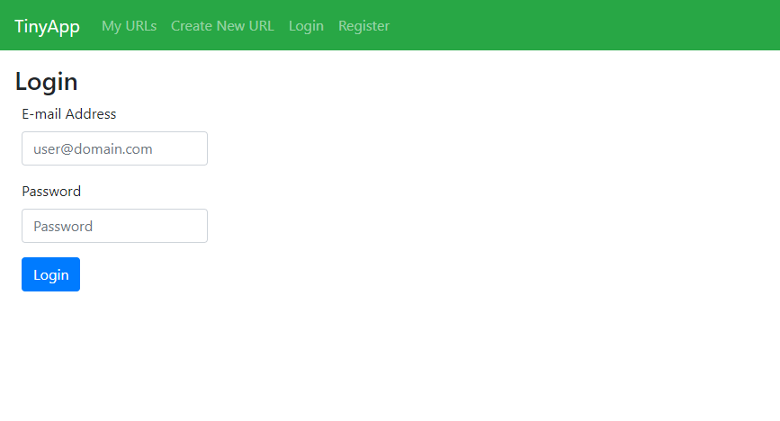

# TinyApp Project

TinyApp is a link shortening service. This web application allows registration by user, and allows users to view, edit, and delete their shortened links. 

## Getting Started

- Clone this repo: `git clone https://github.com/Desyn6/tinyapp.git`
- Install the required dependencies `npm install`
- Start the server using the `npm start` command
- Access TinyApp at  `localhost:8080/login`

## To Use

- Click the "Create New URL" menu item in the header to access the URL creation page
- Enter your desired URL (CAUTION: URL *MUST* include http:// or https:// to work)
- TinyApp will redirect users to the shortened URL page after successful registration of a URL
- The "My URLs" menu item will take users to a list of all of their shortened URLs
  - The shortened URL page can be accessed by clicking the EDIT button. To edit the target URL, enter a new URL in the "New URL" field and click SUBMIT.
  - Shortened URLs can be deleted by clicking the DELETE button

## Additional Features

- Other users and guests are able to view the shortened URL page (e.g., http://localhost:8080/urls/i3BoGr) but will be unable to see the edit URL interface

## Interface Images
Login interface

Screenshot of registration interface

Creating a new URL vis "Create New URL"

URL List as seen by URL owner

URL page as seen by URL owner

URL page as seen by non-user guest

URL page as seen by other users

